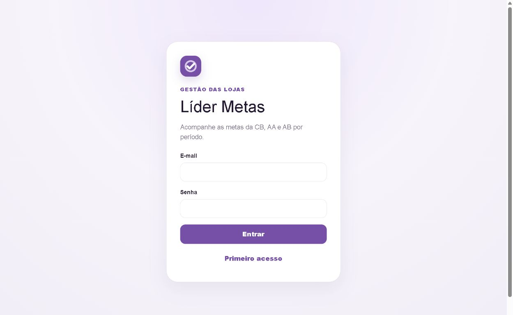
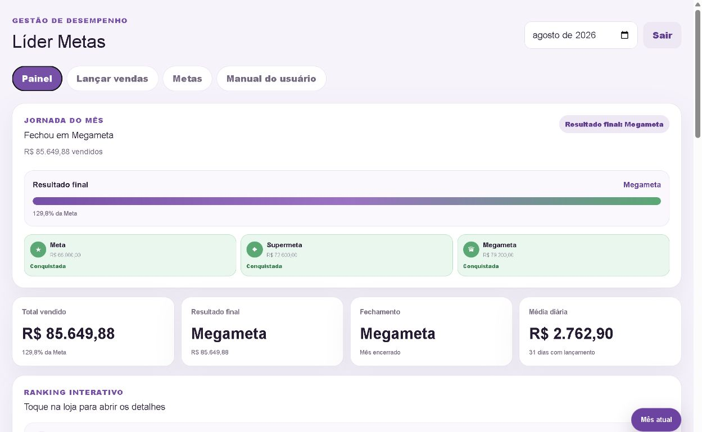
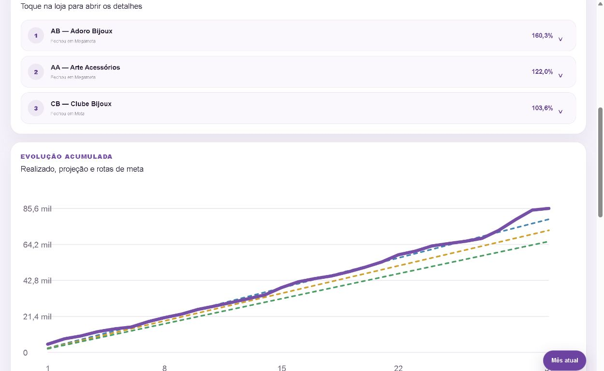
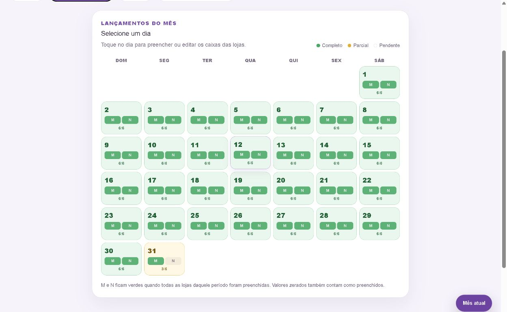
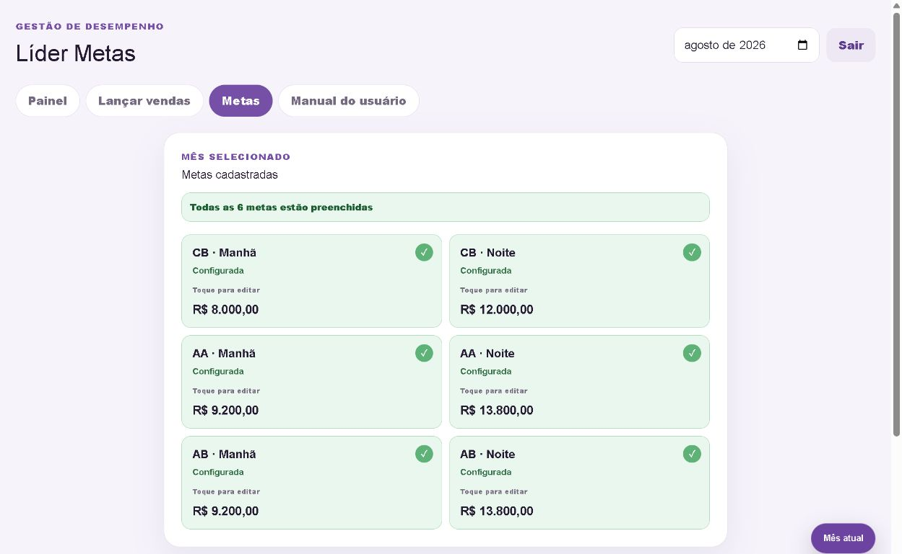

# Líder Metas

Aplicação web de uso interno para acompanhamento de vendas, metas e indicadores gerenciais.

## Principais recursos

- lançamento e conferência de vendas;
- acompanhamento de metas por período;
- painéis, projeções e comparativos;
- acesso restrito a usuários autorizados.

## Tecnologias

Next.js, React, Supabase, Recharts e Vercel.

## Capturas de tela

### Tela de login

### Painel de desempenho

### Ranking e evolução das vendas

### Lançamentos do mês

### Metas cadastradas

## Documentação

A documentação detalhada do projeto está disponível na [Wiki do Líder Metas](https://github.com/camila-ubt/lider-metas/wiki).

## Autoria

Produzido por [@camila-ubt](https://github.com/camila-ubt).
