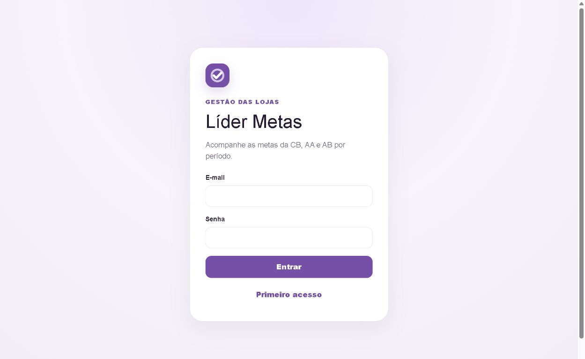
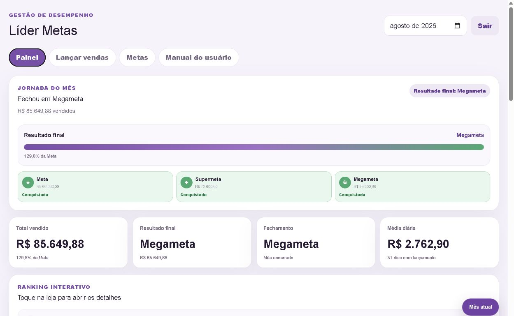
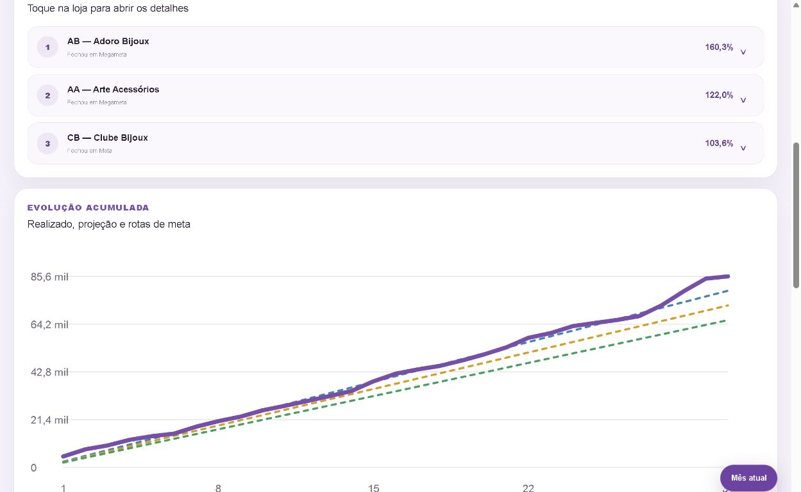
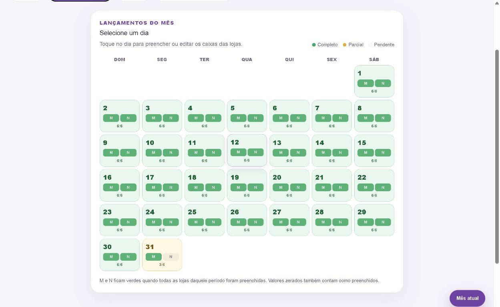
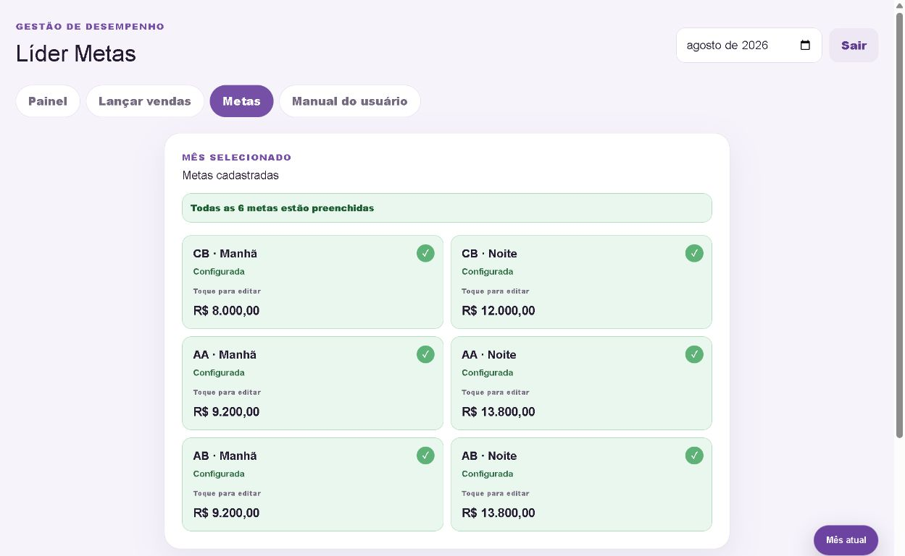

# Líder Metas

Aplicação web de uso interno para acompanhamento de vendas, metas, PA das vendedoras e indicadores gerenciais.

## Principais recursos

- lançamento e conferência de vendas;
- acompanhamento de metas por período, com cálculo do que falta e distribuição do esforço por loja;
- painéis, projeções e comparativos;
- conferência do PA por loja e por vendedora;
- correção de lançamentos de PA com notificação para a vendedora;
- inclusão administrativa de lançamentos ausentes diretamente na conferência do PA, com aviso para a vendedora;
- aprovação e gestão de acesso das vendedoras;
- separação entre solicitações pendentes, perfis ativos e desativados;
- horários de manhã e noite compartilhados com a Calculadora de Metas;
- recuperação de senha pelo link recebido por e-mail;
- limite local de tentativas nos fluxos de login, cadastro e recuperação;
- padronização visual dos nomes das vendedoras em caixa alta;
- acesso restrito a usuários autorizados.

## Integração com a Calculadora de Metas

Os horários configurados para os períodos da manhã e da noite são mantidos no banco e compartilhados com a Calculadora de Metas. Assim, os dois sistemas usam a mesma referência de horários nos cálculos, inclusive nos dias com jornada diferente do turno normal.

## Versão atual

**v1.6.0** — Inclusão de lançamentos pela gestão.

## Atualizações da v1.6.0

- novo botão **Adicionar lançamento** na conferência de cada vendedora;
- seleção de loja, data, vendas e peças sem precisar entrar na conta da vendedora;
- o registro é gravado no mesmo PA e passa a aparecer para a vendedora;
- a vendedora recebe um aviso informando a data e a loja adicionadas pela gestão;
- duplicidades são bloqueadas e direcionadas para o fluxo de correção;
- uma aprovação anterior da loja é invalidada quando um novo lançamento é incluído.

## Tecnologias

Next.js, React, Supabase, Recharts e Vercel.

## Capturas de tela

### Tela de login

### Painel de desempenho

### Ranking e evolução das vendas

### Lançamentos do mês

### Metas cadastradas

## Documentação

A documentação detalhada do projeto está disponível na [Wiki do Líder Metas](https://github.com/camila-ubt/lider-metas/wiki).

## Autoria

Produzido por [@camila-ubt](https://github.com/camila-ubt).
